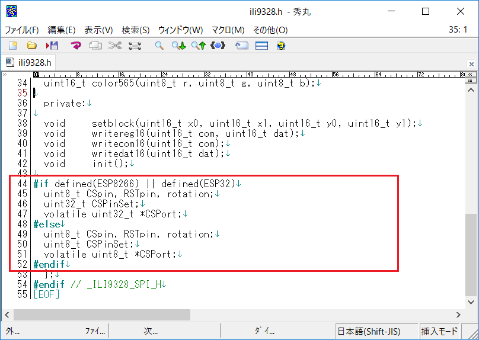

# ESP8266_ILI9328_spiffs_jpeg
ESP8266 + ILI9328でjpeg画像表示テスト。描画速度が遅く実用にはならない。

### 使用した物 ###
* [ESPr Developer（ESP-WROOM-02開発ボード）](https://www.switch-science.com/catalog/2500/ "Title") 
* [aitendo ILI9328/SPI液晶モジュール](http://www.aitendo.com/product/10944 "Title") 
* [ILI9328 Driver Library for Arduino](https://github.com/coord-e/ili9328SPI "Title") 
* [JPEG decoder library](https://github.com/Bodmer/JPEGDecoder "Title") 
* [SPIFFSファイルシステムアップローダー](<https://github.com/esp8266/arduino-esp8266fs-plugin "Title") 

### 接続 ###
ILI9328　　　ESPr Developer 
`VCC_IN-----3.3V`  
`D_GND-----GND`  
`D_CS -----GPIO0`  
`D_RST-----GPIO2`  
`D_SDI-----GPIO13`  
`D_SCK-----GPIO14`  
`D_LED-----GND`  
`D_SDO-----GPIO12`  

### 手順 ###
 1. ILI9328 DriverとJPEG decoderライブラリをインストールします。
 2. ILI9328 Driver Libraryに修正を加えます。 
  
  
 3. SPIFFSファイルシステムアップローダーをインストールします。 
ここを参考にしてください。<https://www.mgo-tec.com/spiffs-filesystem-uploader01-html> 
 4. スケッチをコンパイルしてESPr Developerに書き込みます。
 5. SPIFFSファイルシステムアップローダーで画像ファイルをSPIFFSに転送します。

